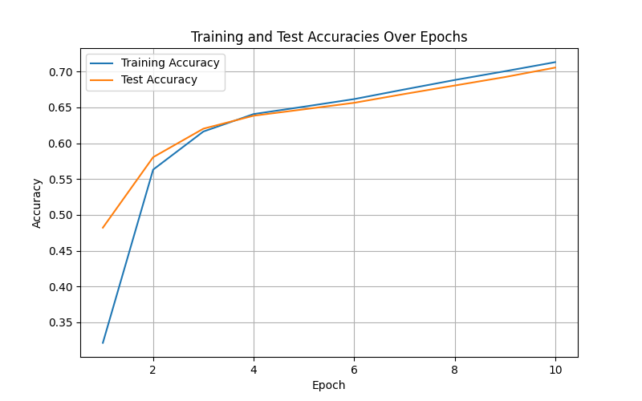

Neural network created using PyTorch to classify 28x28 greyscale images from [here](https://www.kaggle.com/datasets/zalando-research/fashionmnist).

To see classification and testing statistics in terminal, clone repo and run **neural-net-build.py**

Steps taken:

1) Define and load Fashion MNIST training and test sets.
2) Initialize data loaders to handle batching during training and testing.
3) Define the neural network model which subclasses nn.Module
4) Define training/testing loops.
5) Initialize loss function (CrossEntropyLoss) and optimizer (SGD)
6) Run training/testing.

